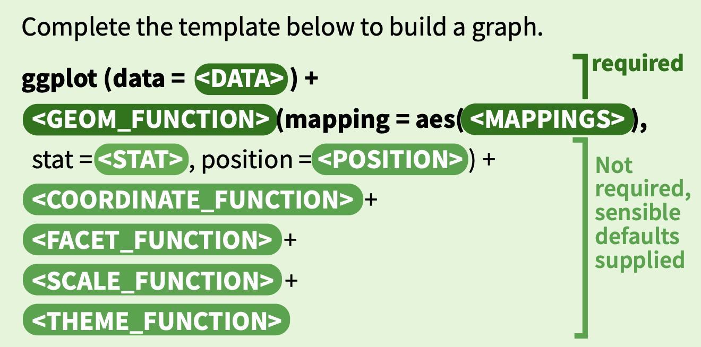

# ggformat

This is a one function addin package. My motivation in writing it was to make it easier to clean up and style **ggplot2** code.

## Installation

`remotes::install_github("jtr13/ggformat")`

## Usage

Highlight code thats produce a single **ggplot2** graph, run the addin "Format ggplot2 code", and the code will be cleaned up and styled. For example, 

```
mtcars %>% ggplot(aes(y = mpg)) + ggtitle("mtcars") + facet_wrap(~gear) + geom_boxplot()
```

will become:

```
mtcars %>%
    ggplot(aes(y = mpg)) +
    geom_boxplot() +
    facet_wrap(~gear) +
    ggtitle("mtcars")
```

## What the styled code looks like

* `%>%`s are followed by line breaks

* Each **ggplot2** function appears on its own line followed by a `+`. Misplaced `+`s, such as after the last function, are removed.

*  **ggplot2** functions are sorted in the following order, based on the **ggplot2** template:

<p style="text-align:center;">
</img>
</p>

Labeling functions (`ggtitle`, `labs`, `xlab`, `ylab`, `annotate`) are placed between scales and themes. Guides are added between labeling functions and themes.

Source: https://github.com/rstudio/cheatsheets/raw/master/data-visualization.pdf

```{r, echo=FALSE}
load("words.rda")
orderwords <- gsub("\\\\\\(", "", orderwords)
orderwords[-1]
```

* If there are multiple instances of a function type, for example, multiple geoms, the current order is preserved.

## How it differs from other formatting packages

* THE BIG DIFFERENCE: Neither **formatR** nor **styler** change the order of **ggplot2** functions.

* **formatR** does not add line breaks after `+`s in **ggplot2** code.

* **styler** reformats long lines by placing putting each argument on its own line and indenting, for example:

```
ggplot() +
    geom_ribbon(data = ribbon, aes(
        ymin = min,
        ymax = max,
        x = x.ribbon,
        fill = 'lightgreen'
    )) +
    geom_line(data = ribbon, aes(x = x.ribbon, y = avg, color = 'black')) +
    geom_line(data = data, aes(x = x, y = new.data, color = 'red')) +
    scale_fill_identity(name = 'the fill',
                        guide = 'legend',
                        labels = c('m1')) +
    scale_colour_manual(
        name = 'the colour',
        values = c('black' = 'black', 'red' = 'red'),
        labels = c('c2', 'c1')
    ) +
    xlab('x') +
    ylab('density')
```

**ggformat** styles this code as: 

```
ggplot() +
    geom_ribbon(data = ribbon, aes(ymin = min, ymax = max, x = x.ribbon, fill = 'lightgreen')) +
    geom_line(data = ribbon, aes(x = x.ribbon, y = avg, color = 'black')) +
    geom_line(data = data, aes(x = x, y = new.data, color = 'red')) +
    scale_fill_identity(name = 'the fill', guide = 'legend', labels = c('m1')) +
    scale_colour_manual(name = 'the colour', values = c('black' = 'black', 'red' = 'red'), labels = c('c2', 'c1')) +
    xlab('x') +
    ylab('density')
```

Note: I hope to add wrapping so long lines are broken apart after commas:

```
# NOT YET IMPLEMENTED
ggplot() +
    geom_ribbon(data = ribbon, aes(ymin = min, ymax = max, x = x.ribbon,
        fill = 'lightgreen')) +
    geom_line(data = ribbon, aes(x = x.ribbon, y = avg, color = 'black')) +
    geom_line(data = data, aes(x = x, y = new.data, color = 'red')) +
    scale_fill_identity(name = 'the fill', guide = 'legend', labels = c('m1')) +
    scale_colour_manual(name = 'the colour', values = c('black' = 'black',
        'red' = 'red'), labels = c('c2', 'c1')) +
    xlab('x') +
    ylab('density')
```

## Known issues

* Doesn't wrap long lines

* Can't handle package namespacing such as `ggalluvial::geom_flow()`

* Can't handle comments (puts them before `+`)


I welcome your suggestions for improvements.

## Acknowledgements

The blog post ["strsplit -- but keeping the delimiter"](https://www.statworx.com/de/blog/strsplit-but-keeping-the-delimiter/) by Jakob Gepp was helpful for formulating `strsplit()` splits that keep the search terms.
